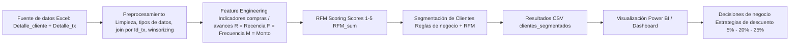
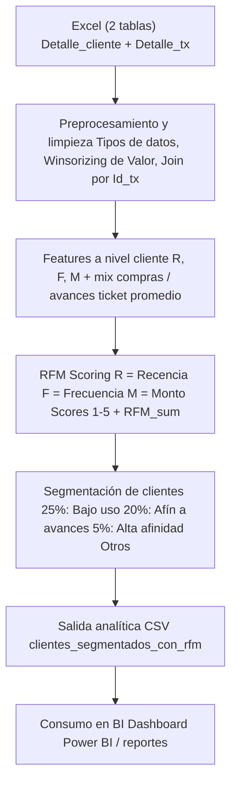

# Prueba Técnica BI – Análisis de Portafolio de Clientes

Este repositorio contiene el desarrollo de una prueba técnica para el rol de **Analista de Datos / BI**, enfocada en:
- Entender el **hábito transaccional** de los clientes (compras, avances, uso del portafolio).
- Diseñar una **segmentación de clientes** para definir estrategias de descuento (5%, 20%, 25%).
- Generar **KPIs de negocio** y visualizaciones replicables en Power BI.

---

## 📌 1. Arquitectura del Proceso Analítico

