# Prueba Técnica BI – Análisis de Portafolio de Clientes

Este repositorio contiene el desarrollo de una prueba técnica para el rol de **Analista de Datos / BI**, enfocada en:
- Entender el **hábito transaccional** de los clientes (compras, avances, uso del portafolio).
- Diseñar una **segmentación de clientes** para definir estrategias de descuento (5%, 20%, 25%).
- Generar **KPIs de negocio** y visualizaciones replicables en Power BI.

---

## 📌 1. Arquitectura del Proceso Analítico

```mermaid
flowchart LR

    A["Fuente de datos\nExcel: Detalle_cliente + Detalle_tx"] 
        --> B["Preprocesamiento\nLimpieza, tipos de datos,\njoin por Id_tx, winsorizing"]

    B --> C["Feature Engineering\nIndicadores compras / avances\nR = Recencia\nF = Frecuencia\nM = Monto"]

    C --> D["RFM Scoring\nScores 1-5\nRFM_sum"]

    D --> E["Segmentación de Clientes\nReglas de negocio + RFM"]

    E --> F["Resultados\nCSV clientes_segmentados"]

    F --> G["Visualización\nPower BI / Dashboard"]

    G --> H["Decisiones de negocio\nEstrategias de descuento\n5% - 20% - 25%"]

```


```mermaid
flowchart TD
    A["Excel (2 tablas)\nDetalle_cliente + Detalle_tx"] --> B["Preprocesamiento y limpieza\nTipos de datos\nWinsorizing de Valor\nJoin por Id_tx"]

    B --> C["Features a nivel cliente\nR, F, M + mix compras / avances\nticket promedio"]

    C --> D["RFM Scoring\nR = Recencia\nF = Frecuencia\nM = Monto\nScores 1-5 + RFM_sum"]

    D --> E["Segmentación de clientes\n25%: Bajo uso\n20%: Afín a avances\n5%: Alta afinidad\nOtros"]

    E --> F["Salida analítica\nCSV clientes_segmentados_con_rfm"]

    F --> G["Consumo en BI\nDashboard Power BI / reportes"]


