# Prueba Técnica BI – Análisis de Portafolio de Clientes

Este repositorio contiene el desarrollo de una prueba técnica para el rol de **Analista de Datos / BI**, enfocada en:
- Entender el **hábito transaccional** de los clientes (compras, avances, uso del portafolio).
- Diseñar una **segmentación de clientes** para definir estrategias de descuento (5%, 20%, 25%).
- Generar **KPIs de negocio** y visualizaciones replicables en Power BI.

---

## 📌 1. Arquitectura del Proceso Analítico

```mermaid
flowchart LR

    A["Fuente de datos Excel: Detalle_cliente + Detalle_tx"] 
        --> B["Preprocesamiento Limpieza, tipos de datos, join por Id_tx, winsorizing"]

    B --> C["Feature Engineering Indicadores compras / avances R = Recencia F = Frecuencia M = Monto"]

    C --> D["RFM Scoring Scores 1-5 RFM_sum"]

    D --> E["Segmentación de Clientes Reglas de negocio + RFM"]

    E --> F["Resultados CSV clientes_segmentados"]

    F --> G["Visualización Power BI / Dashboard"]

    G --> H["Decisiones de negocio Estrategias de descuento 5% - 20% - 25%"]

```

```mermaid
flowchart TD
    A["Excel (2 tablas) Detalle_cliente + Detalle_tx"] --> B["Preprocesamiento y limpieza Tipos de datos, Winsorizing de Valor, Join por Id_tx"]

    B --> C["Features a nivel cliente R, F, M + mix compras / avances ticket promedio"]

    C --> D["RFM Scoring R = Recencia F = Frecuencia M = Monto Scores 1-5 + RFM_sum"]

    D --> E["Segmentación de clientes 25%: Bajo uso 20%: Afín a avances 5%: Alta afinidad Otros"]

    E --> F["Salida analítica CSV clientes_segmentados_con_rfm"]

    F --> G["Consumo en BI Dashboard Power BI / reportes"]
```

